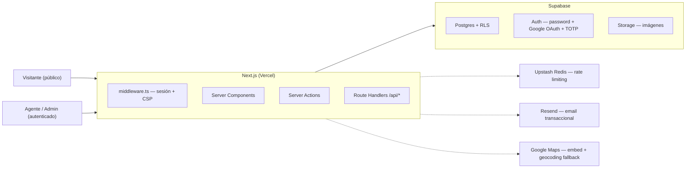

# Documentación del Proyecto — Inmobiliaria DivFlow

> Referencia técnica para cualquier desarrollador que mantenga o escale esta base de código. Explica qué es, cómo está armado, por qué se tomó cada decisión relevante, y qué queda pendiente. Para desplegar esto en un cliente nuevo, ver `docs/DOCUMENTACION-IMPLEMENTACION.md`.

Última actualización: agosto 2026.

---

## 1. Qué es esto

Portal inmobiliario multi-agencia: varias agencias (`agencies`), cada una con sus agentes (`agents`), publican propiedades (`properties`) bajo un catálogo público único con búsqueda avanzada, fichas de propiedad, favoritos, comparador y captura de leads. Tiene un panel de administración (`/admin`) donde los agentes cargan y gestionan sus propias propiedades, y donde un rol de "super-agente" gestiona la red completa (todas las agencias, todos los agentes, auditoría).

Está construido como una **base white-label**: toda la identidad de marca (nombre, colores, contacto, copys, legales) vive en un único punto de configuración (`src/config/client.config.ts`), pensado para reutilizarse en clientes inmobiliarios nuevos sin tocar componentes ni arquitectura. Ver la guía de implementación para el paso a paso de cómo adaptarlo a un cliente nuevo.

---

## 2. Stack tecnológico y por qué

| Tecnología | Uso | Por qué |
|---|---|---|
| **Next.js 16.3** (App Router) | Framework full-stack | Server Components para todo lo que no necesita interactividad (listados, fichas, dashboard admin) reduce el JS que baja al cliente; Server Actions evitan escribir API routes a mano para cada mutación; File-based routing con route groups (`(dashboard)`) separa el layout del panel admin del resto del sitio sin duplicar código. |
| **React 19.2** | UI | Requerido por Next 16. Se usan hooks estándar (`useState`, `useTransition`, `useOptimistic` en algunos formularios) sin librerías de estado global — la app no lo necesita, los datos viven en el servidor y se refrescan con `revalidatePath`. |
| **TypeScript 5.9 (strict)** | Todo el código | Sin `any` implícito, sin `strictNullChecks` relajado. `src/types/database.types.ts` se autogenera desde el esquema real de Supabase (`pnpm db:types`); los tipos de dominio en `src/types/property.ts` y similares (camelCase, para consumo de componentes) siguen siendo manuales por diseño — ver sección 9. |
| **Supabase** (Postgres 17 + PostGIS + Auth + Storage) | Backend completo | Una sola pieza de infraestructura cubre base de datos relacional, autenticación (password + Google OAuth + MFA TOTP), Row Level Security como capa de autorización real (no solo en la app), y Storage para imágenes. Evita mantener un backend propio para un catálogo de este tamaño. |
| **Tailwind CSS v4** | Estilos | Utilidades atómicas, sin CSS-in-JS. La v4 define el design system en `@theme` dentro de `globals.css` (tokens de color, tipografía, radios) en vez de un `tailwind.config.js` — todo el sistema de diseño vive en un solo archivo CSS. |
| **shadcn/ui + Radix UI** | Componentes base (`src/components/ui/`) | Componentes accesibles (focus trap, ARIA, teclado) sin pagar el peso de una librería de componentes completa — se copian al repo y se adaptan, no son una dependencia de npm que actualizar. |
| **Zod** | Validación | Mismo schema de validación se comparte entre formularios client-side y Server Actions — evita que cliente y servidor validen reglas distintas. |
| **Upstash Redis** (`@upstash/ratelimit`) | Rate limiting | Redis serverless con API HTTP (sin conexión TCP persistente) — necesario porque el rate limiting tiene que funcionar entre invocaciones frías distintas de funciones serverless en Vercel; un `Map` en memoria de proceso no sirve para eso (ver sección 8.5). |
| **Resend** | Email transaccional | API de envío simple, tiene tier gratuito, integra con dominios verificados. Usado hoy solo para notificar cambios de contraseña; preparado para leads a futuro. |
| **Google Maps Embed API** | Mapa en ficha de propiedad y selector de ubicación en el admin | Se eligió sobre MapTiler/MapLibre (usado en una iteración anterior) porque el embed vía `<iframe>` no requiere SDK de JS en el cliente — cero bundle extra, cero mantenimiento de una librería de mapas. |
| **Vercel** | Hosting | Despliegue nativo de Next.js (Server Actions, ISR, Edge Middleware) sin configuración adicional. |

---

## 3. Arquitectura general



**Dos clientes de Supabase, con propósitos distintos:**

- `src/lib/supabase/server.ts` (`createClient`) — cliente que **respeta RLS**, usa la sesión del usuario vía cookies. Es el que se usa en Server Components y Server Actions para casi todo. El middleware refresca la sesión en cada request.
- `src/lib/supabase/admin.ts` (`createAdminClient`) — cliente con la `service_role` key, **bypasea RLS por completo**. Marcado con `import "server-only"` para que el build falle si por error se importa en un componente cliente. Solo se usa donde ya se validó todo el input (el endpoint público de leads, y el dashboard admin para conteos agregados que cruzan agencias). Nunca se expone una fila cruda con este cliente — solo conteos o inserts ya validados.

**Middleware (`middleware.ts`)** hace dos trabajos en cada request:
1. Refresca la sesión de Supabase, protege todo `/admin/*` (redirige a login si no hay sesión), fuerza el segundo factor (TOTP) si el agente lo tiene activado, y cierra la sesión por inactividad (30 min sin pegarle a ninguna ruta admin — revoca el refresh token, no es solo un timer de cliente).
2. Agrega headers de seguridad a toda respuesta: CSP, HSTS, `X-Frame-Options: DENY`, `X-Content-Type-Options: nosniff`, `Permissions-Policy`.

---

## 4. Estructura de carpetas

```
src/
├── app/
│   ├── admin/
│   │   ├── (dashboard)/        ← route group: layout con nav, protegido por middleware
│   │   │   ├── page.tsx        ← dashboard (métricas globales)
│   │   │   ├── propiedades/    ← CRUD de propiedades del agente (o todas, si es super-agente)
│   │   │   ├── leads/          ← gestión de leads + export CSV
│   │   │   ├── agentes/        ← gestión de agentes (solo super-agente)
│   │   │   ├── auditoria/      ← historial de cambios (solo super-agente)
│   │   │   └── mi-cuenta/      ← autogestión: foto, contraseña, 2FA
│   │   ├── login/, olvide-password/, reset-password/, mfa-challenge/
│   │   └── auth/callback/      ← intercambio de code OAuth (Google)
│   ├── propiedades/[slug]/     ← ficha pública de propiedad
│   ├── agencias/               ← directorio público de agencias/agentes
│   ├── comparar/, favoritos/, contacto/, legal/
│   └── api/                    ← route handlers públicos (leads, favorites)
├── components/
│   ├── admin/                  ← componentes exclusivos del panel admin
│   ├── property/, search/, compare/, cookies/, layout/
│   └── ui/                     ← shadcn/ui (primitives compartidos)
├── config/
│   └── client.config.ts        ← ÚNICO archivo de identidad de marca (ver sección 7)
├── lib/
│   ├── supabase/                ← los dos clientes (server, admin) + client.ts (browser)
│   ├── queries/                 ← capa de lectura de datos, con cache() de React donde aplica
│   ├── security/                ← rate-limit, hash-ip, validate-image, same-origin
│   ├── email/                   ← cliente Resend + templates
│   ├── validation/               ← schemas Zod compartidos cliente/servidor
│   ├── images/                  ← compresión client-side antes de subir
│   ├── maps/                    ← parser de URLs de Google Maps
│   ├── session/                 ← favoritos por sesión anónima (cookie)
│   └── cookies/                 ← consentimiento de cookies (banner + registry)
└── types/                       ← tipos TS del dominio (propiedad, agente, etc.)
scripts/
└── sync-theme.mjs                ← sincroniza colores de client.config.ts → globals.css (ver sección 7)
```

**Convención establecida:** ningún componente de UI consulta Supabase directo — todo pasa por `src/lib/queries/` (lecturas) o Server Actions colocadas junto a la página que las usa (`actions.ts` en cada carpeta de ruta admin). La única excepción conocida es `src/app/comparar/page.tsx`, que consulta Supabase directo desde el cliente por ser una vista puramente client-side (localStorage de IDs comparados) — está documentado como deuda técnica menor, no como patrón a repetir (ver sección 10).

---

## 5. Modelo de datos

Proyecto Supabase: `divflow-realty` (`kglnrkvwqkyfxcvgncam`, Postgres 17 + PostGIS, `us-east-1`).

### Tablas

| Tabla | Propósito | Notas |
|---|---|---|
| `agencies` | Agencias inmobiliarias | `slug` único, `logo_path` |
| `agents` | Agentes, ligados a una agencia | `auth_user_id` → `auth.users.id` (vincula el login con la ficha del agente). `is_super_agent` marca el rol de administrador de red. |
| `properties` | Propiedades | Ver detalle abajo |
| `property_images` | Galería por propiedad | `is_cover` marca la portada (única por propiedad, garantizado por RPC atómico `set_cover_image`, no por constraint), `sort_order` el orden de galería |
| `amenity_categories` / `amenities` | Catálogo de comodidades | 4 categorías, 22 comodidades |
| `property_amenities` | Relación N:N propiedad↔comodidad | PK compuesta |
| `leads` | Contactos generados desde fichas o formulario general | `property_id` nullable (consulta general), `honeypot_flag`, `ip_hash` (nunca la IP cruda) |
| `favorites` | Favoritos por sesión anónima | PK compuesta `(session_id, property_id)`, sin login |
| `audit_logs` | Historial de altas/ediciones/bajas | Alimentado por trigger `log_audit_event()` en `properties`, `agents`, `leads` — el actor sale de `auth.uid()` resuelto en el momento del cambio, nunca del cliente |

**`properties` — columnas y reglas relevantes:**
- `operation_type`: `venta` | `alquiler` | `alquiler_temporal`
- `property_type`: `casa` | `apartamento` | `local_comercial` | `oficina` | `terreno` | `edificio` | `finca`
- `status`: `borrador` | `publicada` | `pausada` | `archivada` (default `borrador`)
- `price_period`: `unico` (venta) | `mensual` (alquiler) — nullable
- `location` es `geography` **NOT NULL** — toda propiedad necesita lat/lng (`ST_SetSRID(ST_MakePoint(lng,lat),4326)::geography`)
- `area_built_m2` NOT NULL (usar `0` en terrenos), `area_land_m2` nullable (tamaño de lote)
- `slug` único, formato `ciudad-operacion-tipo-referencia-hash8`
- `view_count` incrementado en cada visita a la ficha pública

### Row Level Security

RLS habilitado en todas las tablas propias. Estado real de las policies (verificado por consulta directa a `pg_policies`, no asumido del código):

| Tabla | Lectura pública | Escritura |
|---|---|---|
| `agencies`, `amenities`, `amenity_categories` | Todo (`qual = true`) | Solo super-agente |
| `agents` | Todo (`qual = true`) — incluye `auth_user_id`, ver sección 10 | El propio agente puede actualizar su fila (`auth_user_id = auth.uid()`); super-agente gestiona todas |
| `properties`, `property_images`, `property_amenities` | Solo `status = 'publicada'` | El agente dueño (`agent_id` vía `auth_user_id`) o super-agente |
| `leads` | Nada (sin policy de lectura pública) | El agente dueño de la propiedad relacionada (o `property_id IS NULL`) o super-agente — ver historial de corrección abajo |
| `favorites` | Todo (`qual = true`, sin autenticación) | Todo — es la naturaleza del feature (favoritos anónimos por `session_id` de cookie, sin login) |
| `audit_logs` | Solo super-agente | Solo el trigger (`security definer`) |

**Nota de arquitectura importante sobre RLS:** las policies de Postgres son **permisivas por defecto** — para un mismo comando (`SELECT`, `UPDATE`, etc.), si conviven dos policies, el resultado es el **OR** de ambas. Esto ya causó un incidente real: `leads` tuvo en algún momento una policy amplia (`qual = true` para cualquier `authenticated`) conviviendo con una policy bien scopeada por agencia — la amplia anulaba a la scopeada por completo, permitiendo a cualquier agente leer/editar/borrar leads de cualquier agencia. Se corrigió reemplazando todas las policies de `leads` por dos policies `FOR ALL` mutuamente excluyentes (`agents_manage_own_leads`, `super_agents_manage_all_leads`), replicando el patrón que ya usaba correctamente `properties`. **Regla para cualquier policy nueva:** nunca agregar una policy con `qual = true` a una tabla que ya tiene una policy scopeada para el mismo comando — auditar con `select * from pg_policies where tablename = '...'` antes de asumir que el scoping existente sigue siendo efectivo.

### Funciones Postgres relevantes

- `current_agent_is_super()` — `security definer`, resuelve `is_super_agent` del agente autenticado. Base de casi todas las policies de super-agente.
- `search_properties(...)` — RPC que resuelve el listado público con filtros (operación, tipo, ciudad, rango de precio, hab/baños/estacionamientos, comodidades) y paginación **server-side real** (devuelve `total_count` en la misma fila, sin traer el dataset completo). `security definer`, ejecutable por `anon`.
- `get_property_by_slug(slug)` — resuelve una ficha completa (propiedad + imágenes + comodidades + agente) en una sola llamada. `security definer`, ejecutable por `anon`.
- `set_cover_image(property_id, image_id)` — cambio de portada atómico (una sola sentencia UPDATE), reemplaza dos UPDATEs secuenciales que podían dejar 0 o 2 portadas bajo acceso concurrente.
- `log_audit_event()` — trigger en `properties`/`agents`/`leads`, calcula el diff campo por campo en updates (excluyendo `location`/`updated_at` para no ensuciar el log con ruido) e inserta en `audit_logs`.

---

## 6. Flujos clave

### 6.1 Autenticación y sesión (admin)

- **Login:** email + contraseña, o Google OAuth. El registro público está deshabilitado en Supabase Auth a propósito — los agentes se dan de alta desde `/admin/agentes` (solo super-agente), no hay self-signup.
- **2FA (TOTP), opcional por agente:** si el agente activó un factor verificado, el middleware exige `aal2` en cada request a `/admin/*`. **Detalle importante:** el gate NO usa `getAuthenticatorAssuranceLevel().nextLevel` — es un bug conocido del SDK de Supabase (`supabase/auth-js#589`) donde ese campo se queda en `aal1` aunque el usuario sí tenga un factor verificado, y el challenge nunca se dispara. Se usa `currentLevel` (viene firmado en el JWT, confiable) comparado contra `listFactors()` preguntado directo. Si se actualiza `@supabase/supabase-js` en el futuro, revisar si este bug sigue vigente antes de "simplificar" este código.
- **Recuperar contraseña:** flujo PKCE estándar de Supabase (`resetPasswordForEmail` → email con link → `/admin/auth/callback` intercambia el code por sesión → `/admin/reset-password` fija la nueva). **Limitación conocida:** el `code_verifier` PKCE queda atado al navegador que originó el pedido — si el agente lo pide desde la compu y abre el email desde el celular, el intercambio falla con "el enlace venció o ya se usó", mensaje que no refleja la causa real. No hay forma de evitar esto sin cambiar de PKCE a un flujo de OTP por código numérico. Mismo motivo detrás de los errores `otp_expired`: el link también se invalida si algún escáner de seguridad del cliente de correo (Gmail/Outlook) lo "abre" automáticamente antes que el usuario.
- **Cuentas logueadas solo con Google:** la UI de "Mi cuenta" detecta si el único método de login registrado es `google` (vía `currentAuthenticationMethods` del AAL) y oculta la opción de "cambiar contraseña", mostrando en su lugar un aviso — no tiene sentido ofrecer cambiar una contraseña que no existe.
- **Inactividad:** cookie `df_admin_last_seen`, 30 minutos. Es un control **server-side** (revoca el refresh token real), no un timer de cliente evadible.

### 6.2 Búsqueda y listado público

`src/lib/queries/search-properties.ts` llama al RPC `search_properties`. Los filtros se validan con Zod (`src/lib/validation/property-filters.ts`) y viven en la URL (query params), no en estado de cliente — permite compartir/bookmarkear una búsqueda. `src/hooks/use-property-filters.ts` memoiza la construcción de la URL para no disparar renders de más.

### 6.3 Ficha de propiedad

`get_property_by_slug` resuelve todo en una llamada. El JSON-LD (`schema.org/Product` para SEO) se serializa con un escape explícito de `<` → `<` antes de inyectarse vía `dangerouslySetInnerHTML` — sin esto, un título/descripción de propiedad con `</script><script>...` ejecutaría JS arbitrario contra cualquier visitante (era un XSS real, corregido). Compartir usa Web Share API con fallback a WhatsApp/copiar link, y Open Graph dinámico con la imagen de portada.

### 6.4 Favoritos y comparador

Favoritos: sin login, identificados por un `session_id` en cookie (`src/lib/session/favorites-session.ts`), persistidos en la tabla `favorites` (RLS abierta a propósito, es el diseño del feature). Comparador: hasta 4 propiedades, IDs en `localStorage` vía `src/lib/compare/compare-context.tsx`, resuelve los datos completos contra Supabase al render.

### 6.5 Leads (`POST /api/leads`)

Capas de protección, en orden:
1. `isSameOrigin` — rechaza requests con `Origin` distinto al del propio sitio.
2. Validación Zod (`leadSchema`).
3. Honeypot (campo `website` oculto — si viene lleno, es un bot) + time-trap (rechaza envíos en menos de 1.5s, imposible de completar a mano). A un bot detectado se le responde `200 OK` igual, sin señal de que fue detectado — pero el lead real nunca se escribe.
4. Rate limit por hash de IP (5 por minuto).
5. Insert con `createAdminClient()` (bypasea RLS a propósito — es el único punto de entrada público que escribe en `leads`, y ya pasó por todas las validaciones anteriores).

La IP nunca se guarda cruda: `hashIp()` la hashea con SHA-256 + salt (`IP_HASH_SALT`, ver sección 8.4).

### 6.6 CRUD de propiedades (admin)

`src/components/admin/new-property-form.tsx` orquesta el alta: datos básicos → ubicación (pegar URL de Google Maps, que se parsea con `src/lib/maps/parse-maps-url.ts`; si el link no trae coordenadas embebidas, hay un fallback server-side de geocoding) → comodidades → imágenes (compresión client-side antes de subir, `src/lib/images/compress-image.ts`, drag & drop con reorder y selección de portada). Todas las Server Actions de mutación (`propiedades/actions.ts`) hacen `.select()` de vuelta tras la mutación y verifican filas afectadas — si RLS bloqueó silenciosamente la operación, se informa un error real en vez de reportar éxito falso. `updatePropertyStatus` además filtra por el `status` actual conocido en el cliente (no solo por `id`), para detectar ediciones concurrentes en vez de pisarlas en silencio.

### 6.7 Emails transaccionales

`src/lib/email/` envuelve Resend. **Degradación elegante por diseño:** sin `RESEND_API_KEY` configurada, `getResendClient()` devuelve `null` y el email simplemente no se manda (se loguea un aviso) — el flujo que originó el email (cambio de contraseña) igual se completa. Mismo criterio aplicado a Google Maps: una integración externa ausente nunca debe romper el flujo principal. Todo valor interpolado en el HTML del email (IP, nombre de agente) pasa por un `escapeHtml()` — la IP sale de un header (`x-forwarded-for`) que el cliente puede falsificar, así que no es un dato confiable para interpolar crudo.

### 6.8 Rate limiting

`src/lib/security/rate-limit.ts`: con `UPSTASH_REDIS_REST_URL`/`TOKEN` configuradas, usa sliding window real sobre Redis. Sin esas variables, cae a un `Map` en memoria del proceso — funciona en desarrollo, pero **no protege nada en producción real**: cada instancia serverless de Vercel tiene su propio `Map`, así que el límite no es efectivo entre invocaciones frías distintas. Loguea un `console.warn` explícito en producción si detecta que Upstash no está configurado, para que el gap sea visible.

### 6.9 Auditoría

Trigger de Postgres (`log_audit_event`), no código de aplicación — así ningún camino de escritura (Server Action, RPC, edición manual desde el dashboard de Supabase) puede evitar quedar registrado. Calcula el diff campo por campo solo en updates reales (si no cambió nada relevante, no inserta fila). Visible en `/admin/auditoria`, solo para super-agente.

---

## 7. Sistema de marca white-label (para desarrolladores)

Esta base está diseñada para reutilizarse en clientes inmobiliarios nuevos sin tocar componentes ni arquitectura. La guía completa paso a paso está en `docs/DOCUMENTACION-IMPLEMENTACION.md` — esta sección explica **cómo funciona** para quien necesite mantenerlo o extenderlo.

- **`src/config/client.config.ts`** es el único archivo que un cliente nuevo edita: nombre de marca, paleta de colores, contacto, WhatsApp, redes sociales, copys del hero/about, zonas de cobertura, textos legales, y `seo.siteUrl`.
- **Colores:** Tailwind v4 compila las clases de color (`bg-brand-accent`, etc.) a partir de tokens CSS estáticos en `src/app/globals.css` (`@theme`) — Tailwind escanea ese CSS en build time, no puede leer un objeto de TypeScript en runtime. Para que el cliente igual solo tenga que tocar `client.config.ts`, existe `scripts/sync-theme.mjs`: lee `clientConfig.brand.colors` (por regex, sin ejecutar el TS) y reescribe las 5 líneas `--color-brand-*` de `globals.css`. Está enganchado como `predev`/`prebuild` en `package.json` — corre solo antes de cada `pnpm dev`/`pnpm build`, nadie tiene que acordarse de invocarlo a mano. Si se agrega un color nuevo a `ClientConfig.brand.colors`, hay que agregarlo también al array `COLOR_KEYS` del script y a `@theme` en `globals.css`.
- **Logo:** `src/components/layout/logo.tsx` referencia archivos en `public/brand/` — reemplazar los PNG/SVG, no hace falta tocar el componente salvo que cambie el aspect ratio.
- **Secretos** (API keys, tokens) nunca van en `client.config.ts` — solo el *nombre* de la variable de entorno esperada (ver `integrations` en el tipo `ClientConfig`). Los valores van en `.env.local`/Vercel.
- **Datos de propiedades:** hoy siempre `propertyData.source: "manual"` (carga desde el panel admin). El tipo ya contempla un modo `"api"` para sincronizar desde un feed externo, pero no está implementado — sería un módulo nuevo, no un toggle.

---

## 8. Seguridad — estado actual (agosto 2026)

### 8.1 Resuelto y verificado

- RLS de `leads` scopeada correctamente por agencia (ver sección 5).
- XSS en JSON-LD de ficha de propiedad, corregido (escape de `<`).
- HTML injection en email transaccional, corregido (`escapeHtml`).
- Defensa en profundidad en Server Actions de `leads` y `propiedades` (no dependen solo de RLS).
- `uploadPropertyImages` revierte el archivo de Storage si el insert en `property_images` falla.
- `setCoverImage` es atómico (RPC de una sola sentencia).
- Headers de seguridad completos (CSP, HSTS, `X-Frame-Options`, `Permissions-Policy`, `nosniff`).
- Mensajes de login/reset genéricos (no permiten enumerar emails registrados).
- Cierre de sesiones remotas tras cambio de contraseña; expiración por inactividad server-side.
- Validación de imágenes por magic bytes (no solo extensión/mimetype declarado) en ambos flujos de upload.
- Sin secretos hardcodeados en el código; sin inyección SQL (todo vía query builder o RPC parametrizados).

### 8.2 Pendiente conocido — no bloqueante, agendar

Verificado con `get_advisors` de Supabase (estado real, no del código):

- **Leaked Password Protection:** aparece como deshabilitada en los advisors de Supabase al momento de este documento. Requiere plan Pro de Supabase para activarse desde el dashboard — confirmar el plan actual antes de asumir que está resuelto.
- **`postgis` instalada en el schema `public`** en vez de un schema dedicado (`extensions`). Warning de Supabase, no explotable en este caso de uso, pero es la práctica recomendada moverlo.
- **Funciones `SECURITY DEFINER` ejecutables por `anon`/`authenticated` vía RPC:** `get_property_by_slug`, `search_properties`, `log_audit_event`, y las funciones internas de PostGIS (`st_estimatedextent`). Las dos primeras son intencionales (necesitan leer más allá de lo que la RLS del visitante anónimo permitiría por sí sola, para resolver el catálogo público). Revisar si conviene restringir explícitamente el `GRANT EXECUTE` de las funciones de PostGIS si no se usan vía API pública.
- **`public.spatial_ref_sys`** (tabla interna de PostGIS) con RLS deshabilitado. No es una tabla de la app — decisión consciente pendiente de tomar, ver `.env.example`/histórico del proyecto.
- **`public_read_agents`** expone `auth_user_id` en la lectura pública (`qual = true`). Bajo impacto real, pero es sobre-exposición innecesaria — bastaría con una vista que excluya esa columna para el consumo público.
- **CSV export de leads** (`/admin/leads/export`) no neutraliza celdas que empiecen con `=`, `+`, `-`, `@` — un lead con un mensaje que empiece así puede ejecutar una fórmula al abrirse en Excel/Sheets (CSV/formula injection). Fix acotado: sanitizar `csvEscape` en `src/app/admin/(dashboard)/leads/export/route.ts`.
- **Salt de hash de IP con fallback hardcodeado** en `src/lib/security/hash-ip.ts` (`"divflow-realty-dev-salt"`) si `IP_HASH_SALT` no está seteada — confirmar que la variable real está seteada en cada entorno de producción (no solo en el proyecto original).
- **Reset de contraseña cross-device (PKCE):** ver sección 6.1 — limitación de diseño de Supabase Auth, no un bug propio.

### 8.3 Deuda técnica de calidad/rendimiento — no bloqueante

- `getProperty()` (ficha pública) y `getCurrentAgent()` no están envueltos en `cache()` de React — se resuelven más de una vez por request tree en algunas páginas. El patrón correcto ya existe en el proyecto (`get-favorite-ids.ts`, `get-amenities.ts`) — replicarlo.
- Duplicación menor: `initials()`, `formatPrice()`, mapas de etiquetas (`OPERATION_LABEL`/`TYPE_LABEL`) y `MAX_IMAGE_BYTES` están redefinidos en 2-3 lugares en vez de vivir una sola vez en `src/lib/`.
- `src/app/comparar/page.tsx` es el único punto que consulta Supabase directo desde el cliente en vez de pasar por `src/lib/queries/` (ver sección 4).
- `uploadPropertyImages` sube archivos de forma secuencial (`await` uno por uno) — paralelizable con `Promise.all` para el upload y un insert batcheado al final.
- Sin `not-found.tsx` de marca en rutas públicas (cae al 404 default de Next, sin header/footer).
- `deleteProperty` no limpia el bucket de Storage — las imágenes quedan huérfanas tras el `ON DELETE CASCADE` de la fila (costo acumulado en Storage, no rompe nada funcionalmente).
- Sin camino in-app para recuperar acceso si el único super-agente pierde contraseña y dispositivo TOTP a la vez — mitigable exigiendo un mínimo de 2 super-agentes activos (hoy solo se bloquea la autodegradación cuando ya queda 1, no se exige un mínimo proactivamente).

Ninguno de los puntos de 8.2/8.3 bloquea producción — el proyecto ya pasó por una auditoría completa de seguridad (agosto 2026) donde los hallazgos críticos y altos fueron corregidos y verificados contra la base de datos real. Esto queda como la lista de "siguiente tanda" para quien continúe el mantenimiento.

---

## 9. Convenciones para mantener y escalar

- **Nunca** consultar Supabase directo desde un componente — pasar por `src/lib/queries/` (lectura) o una Server Action en `actions.ts` (escritura). Si una página nueva necesita datos, primero mirar si ya existe una query reutilizable en `src/lib/queries/`.
- **Nunca** confiar solo en RLS para una mutación sensible — las Server Actions de `agentes/actions.ts` son el patrón de referencia: chequeo explícito de `getCurrentAgent()`/rol, además de RLS, documentado en el propio código como defensa en profundidad.
- **Toda mutación admin** debe hacer `.select()` de la fila afectada tras el `UPDATE`/`DELETE`/`INSERT` y verificar que realmente afectó filas — así un bloqueo silencioso de RLS se reporta como error real, no como éxito falso.
- **Toda función Postgres nueva** debe declarar explícitamente `SECURITY INVOKER` (default, preferido) o justificar por qué necesita `SECURITY DEFINER`, y en ese caso `SET search_path = ''` para evitar hijacking de funciones por schema.
- **Antes de agregar una policy RLS nueva**, consultar `pg_policies` de la tabla real — no asumir el estado a partir de comentarios en el código ni de migraciones viejas (recordatorio directo del incidente de `leads`, sección 5).
- **Componentes de imagen (`next/image`) con `fill`** siempre necesitan `sizes` explícito — sin eso, Next no puede optimizar qué tamaño de imagen servir y lo señala como warning en consola.
- **Antes de un deploy**, correr `pnpm typecheck && pnpm lint && pnpm build` localmente — el proyecto tiene TypeScript estricto y ESLint configurado, ambos deben pasar limpio. Además, `.github/workflows/ci.yml` corre lo mismo automáticamente en cada PR/push a `develop`/`main` (el job de build necesita `NEXT_PUBLIC_SUPABASE_URL`/`NEXT_PUBLIC_SUPABASE_ANON_KEY`/`SUPABASE_SERVICE_ROLE_KEY` cargadas como Secrets del repo en GitHub — sin eso, ese job falla por falta de configuración, no por un error de código).
- **Variables de entorno:** `src/env.ts` las valida con Zod al arrancar (importado desde `next.config.ts`, corre antes de cualquier build/dev). Si falta algo requerido, el proceso corta ahí mismo con un mensaje legible — no dependas de que un `process.env.X!` truene más adelante en un punto random del código. Si agregás una variable de entorno nueva al proyecto, agregala también al schema de `src/env.ts` (y a `.env.example`, y a la tabla de la guía de implementación).
- **Tipos de Supabase:** `src/types/database.types.ts` es autogenerado (`pnpm db:types`, requiere Supabase CLI logueado) — no editarlo a mano, y regenerarlo cada vez que cambie el esquema (tabla, columna, enum nuevo). Los tres clientes de Supabase (`src/lib/supabase/{server,client,admin}.ts`) ya están tipados con `createClient<Database>`. Los tipos de dominio en `src/types/property.ts` (y similares, en camelCase, pensados para consumo directo de componentes) siguen siendo manuales — es una capa de traducción, no un duplicado a eliminar, pero si el esquema cambia hay que revisar si siguen reflejando la realidad.

---

## 10. Decisiones de diseño no obvias (para no "corregirlas" por error)

- El bug del SDK de Supabase con `nextLevel` en el gate de 2FA (sección 6.1) es intencional — no simplificar a `nextLevel` sin verificar primero si Supabase lo corrigió en una versión más nueva.
- El fallback en memoria del rate limiter (sin Upstash) es intencional — preferible a bloquear login/reset/leads por completo si alguien despliega sin Upstash configurado todavía. No convertir esto en un error duro.
- `whatsapp: null` en `client.config.ts` no es un dato faltante por accidente — es el mecanismo real para ocultar el botón de WhatsApp sin tocar código (ver sección 7 y la guía de implementación).
- Los emails que no se envían por falta de `RESEND_API_KEY` no son un bug — es degradación elegante deliberada, igual que la ausencia de `NEXT_PUBLIC_GOOGLE_MAPS_EMBED_KEY` (el mapa muestra un fallback en vez de romper la página).
